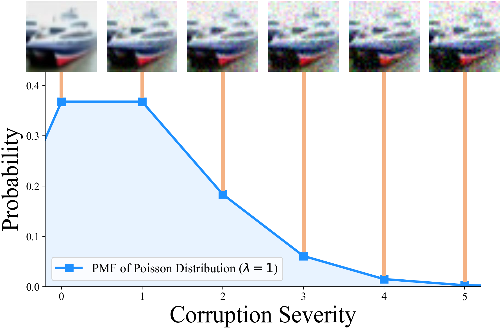

## [CVPR 2023: Robust Generalization against Photon-Limited Corruptions via Worst-Case Sharpness Minimization](https://arxiv.org/pdf/2303.13087.pdf)

Zhuo Huang<sup>1, *</sup>, Miaoxi Zhu<sup>2, *</sup>, Xiaobo Xia<sup>1</sup>, Li Shen<sup>3</sup>, Jun Yu<sup>4</sup>, Chen Gong<sup>5</sup>, Bo Han<sup>6</sup>, Bo Du<sup>2</sup>, Tongliang Liu<sup>1</sup>

<sup>1</sup>The University of Sydney, <sup>2</sup>Wuhan University,  <sup>3</sup>JD Explore Academy, <sup>4</sup>University of Science and Technology of China, <sup>5</sup>Nanjing University of Science and Technology, <sup>6</sup>Hong Kong Baptist University



## Abstract
Robust generalization aims to tackle the most challenging data distributions which are rare in the training set and contain severe noises, i.e., photon-limited corruptions. Common solutions such as distributionally robust optimization (DRO) focus on the worst-case empirical risk to ensure low training error on the uncommon noisy distributions. However, due to the over-parameterized model being optimized on scarce worst-case data, DRO fails to produce a smooth loss landscape, thus struggling on generalizing well to the test set. Therefore, instead of focusing on the worst-case risk minimization, we propose SharpDRO by penalizing the sharpness of the worst-case distribution, which measures the loss changes around the neighbor of learning parameters. Through worst-case sharpness minimization, the proposed method successfully produces a flat loss curve on the corrupted distributions, thus achieving robust generalization. Moreover, by considering whether the distribution annotation is available, we apply SharpDRO to two problem settings and design a worst-case selection process for robust generalization. Theoretically, we show that SharpDRO has a great convergence guarantee. Experimentally, we simulate photon-limited corruptions using CIFAR10/100 and ImageNet30 datasets and show that SharpDRO exhibits a strong generalization ability against severe corruptions and exceeds well-known baseline methods with large performance gains.

This is an PyTorch implementation of SharpDRO.

## Requirements
- python 3.6+
- torch 1.4
- torchvision 0.5
- numpy

## Usage

### Dataset Preparation
This repository needs CIFAR10, CIFAR100, or ImageNet-30 to train a model.

First please follow instructions of [Benchmarking Neural Network Robustness to Common Corruptions and Perturbations](https://github.com/hendrycks/robustness) to generate common corruptions. The codes for CIFAR10, CIFAR100, and ImageNet-30 can also be found in `./corruptions/`.

Then, the photon-limited corruptions with poisson distribution would be automatically produced by `./dataset/prepare_dataset.py`.

For ImageNet-30, we provide a pre-splited file lists in `./imagenet30_filelist/` folder. To generate your own file lists, you can run `python ./imagenet30_filelist/split_imagenet30.py`

All datasets are supposed to be under `./data`.

### Train
Train your model:

```
python main.py --num_severity number-of-selected-severities -c type-of-the-corruption  -n number-of-training-data-per-class --lr 0.1 --total_epoch 200 -d dataset --log_dir logs --desc training-description
```

### Acknowledgement
Some of the codes are depend on [Distributionally Robust Neural Networks for Group Shifts: On the Importance of Regularization for Worst-Case Generalization](https://github.com/kohpangwei/group_DRO). 
 Appreciate their contributions.

### Reference
If you find this code helpful, please consider citing our paper, thanks!

```
@article{huang2023robust,
  title={Robust Generalization against Photon-Limited Corruptions via Worst-Case Sharpness Minimization}, 
  author={Zhuo Huang and Miaoxi Zhu and Xiaobo Xia and Li Shen and Jun Yu and Chen Gong and Bo Han and Bo Du and Tongliang Liu},
  journal={arXiv preprint arXiv:2303.13087},
  year={2023}
}
```

